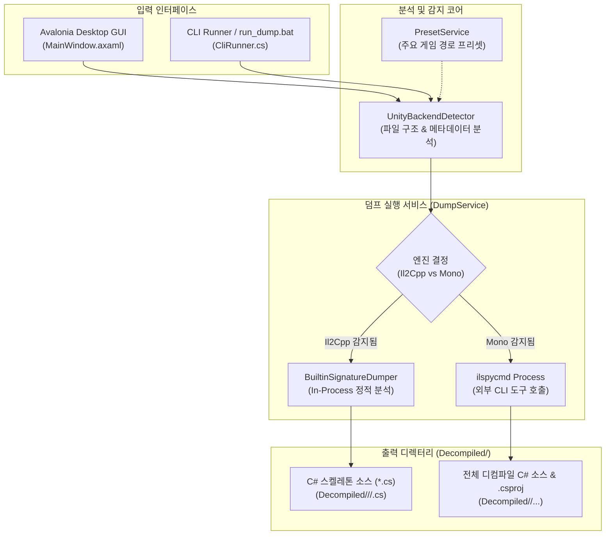
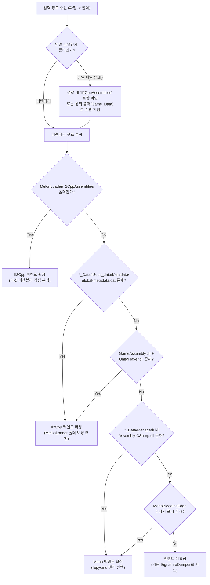

# 아키텍처 및 동작 파이프라인 (Architecture & Pipeline)

이 문서는 `Modding Support Tool`의 전반적인 시스템 아키텍처와 게임 백엔드 판별, 디컴파일/시그니처 덤프 파이프라인의 내부 동작 원리를 설명합니다.

---

## 1. 전체 시스템 구조도

---

## 2. Unity 백엔드 판별 로직 상세 ([`UnityBackendDetector.cs`](file:///h:/source/repos/modding%20support%20tool/ModdingSupportTool/Core/Detection/UnityBackendDetector.cs))

Unity 게임은 빌드 시점에 어떤 백엔드를 사용했는지에 따라 파일 구조가 확연히 다릅니다. 본 도구는 이를 휴리스틱 및 시그니처 파일 체크를 통해 100% 자동 판별합니다.

---

## 3. 내장 SignatureDumper 동작 파이프라인 ([`BuiltinSignatureDumper.cs`](file:///h:/source/repos/modding%20support%20tool/ModdingSupportTool/Core/BuiltinSignatureDumper.cs))

Il2Cpp 게임의 경우 MelonLoader가 생성한 더미 어셈블리(`.dll`)를 런타임 게임 실행 없이 오프라인에서 읽어들입니다.

### 1) 격리 로딩 (`AssemblyLoadContext`)
- 분석 대상 어셈블리가 프로세스에 영구 잠금되는 문제를 방지하기 위해 매 덤프 시마다 `isCollectible: true` 속성의 임시 ALC를 생성합니다.
- 어셈블리가 참조하는 MelonLoader 기본 의존성(`net6`, `net472`, `net35`, `Dependencies/SupportModules`)을 `alc.Resolving` 이벤트 핸들러에서 자동 해결합니다.

### 2) 리플렉션 정적 분석 (`System.Reflection`)
- `asm.GetTypes()`로 로드된 타입 메타데이터를 순회하며 다음 정보들을 추출하여 `TypeSignatureInfo` 모델을 빌드합니다:
  - **타입 원형**: `class`, `struct`, `interface`, `enum`, `delegate` 구분.
  - **상속 및 구현**: 베이스 클래스 및 모든 인터페이스 목록.
  - **필드 & 상수**: `const`, `static`, `readonly`, 접근 제어자, 기본 리터럴 값.
  - **프로퍼티**: `get;`, `set;`의 개별 접근 제어자(예: `public int Value { get; private set; }`).
  - **생성자 & 메서드**: 리턴 타입, 제네릭 인자, 파라미터(`ref`, `out`, `params`, 디폴트 인자).

### 3) 소스 파일 분할 생성
- 전체 클래스가 한 파일에 뭉쳐 있으면 검색 및 Git 형상 관리가 어렵기 때문에, 각 타입별로 독립된 `.cs` 파일을 생성합니다:
  - **저장 규칙**: `<OutputDirectory>/<Namespace>/<TypeName>.cs`
  - 네임스페이스가 없는 글로벌 타입은 `<OutputDirectory>/<TypeName>.cs`에 직접 저장됩니다.
- 분석이 끝나면 ALC를 언로드(`alc.Unload()`)하여 파일 핸들과 메모리를 즉시 반환합니다.

---

## 4. Mono 디컴파일 파이프라인 (`ilspycmd`)

- Mono 백엔드로 감지되었거나 사용자가 `ilspycmd`를 선택한 경우:
  - 대상 어셈블리(`Assembly-CSharp.dll` 등)에 대해 `ilspycmd` CLI를 백그라운드 프로세스로 호출합니다.
  - 실행 인수:
    - `-p`: C# 프로젝트 파일(`.csproj`) 생성
    - `--nested-directories`: 네임스페이스에 맞춘 폴더 분할
    - `-o "<OutputDir>"`: 디컴파일 결과 출력 위치
  - 표준 출력(stdout) 및 표준 에러(stderr) 스트림을 비동기 가로채어 GUI/CLI 실시간 터미널 화면에 뿌려줍니다.
  - 작업 취소 시 프로세스 트리 전체를 정리(`Kill(entireProcessTree: true)`)하여 좀비 프로세스를 방지합니다.
